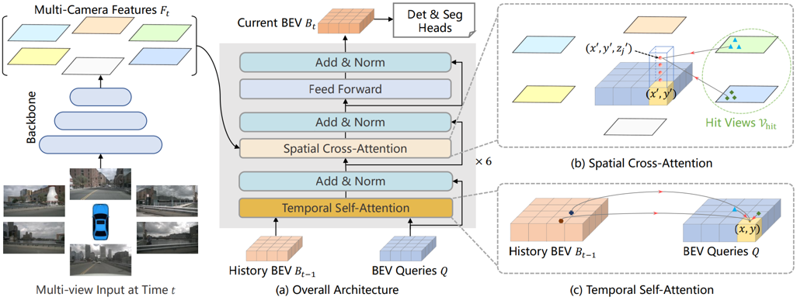
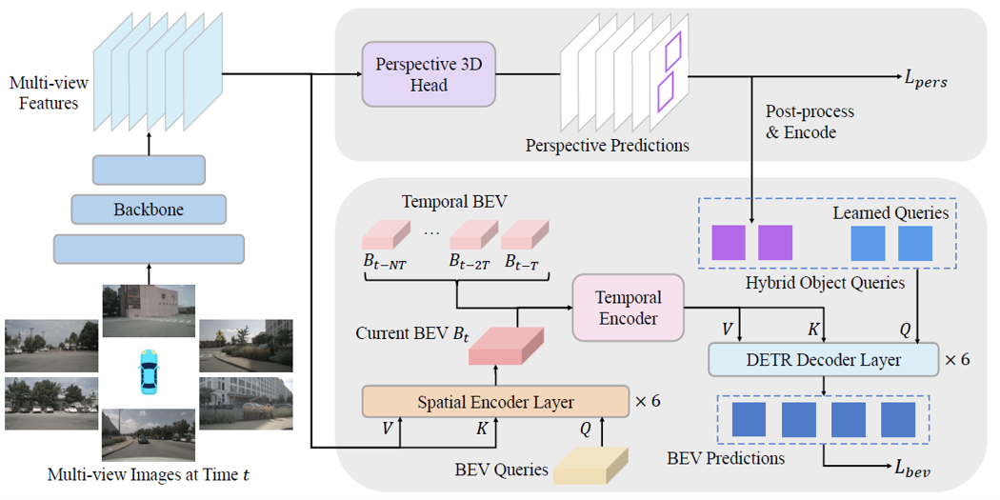
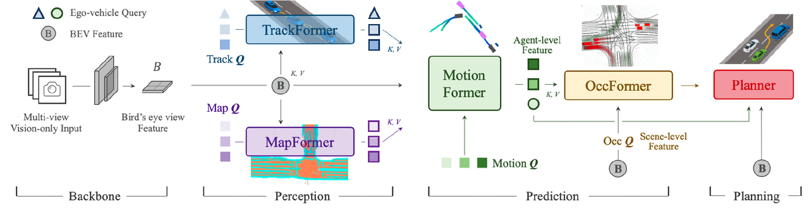

# Perception and Decision Making Intergration for Autonomous Driving

Our main focus is on researching 2D image perception and multi-sensor 3D surround perception methods. We aim to explore solutions that integrate perception and decision making end-to-end and create a universal framework for autonomous driving. Our goal is to advance autonomous driving technology into a new phase.



## Representative work:

### Universal framwork for Bird's-Eye-View (BEV) recognition, BEV feature construction and model optimization

- [**BEVFormer: Learning Bird's-Eye-View Representation from Multi-Camera Images via Spatiotemporal Transformers**](https://arxiv.org/abs/2203.17270)

     [ECCV 2022 6th most influential paper]  [The 100 most cited AI papers of 2022]  [Ranking 1st on Waymo 2022] 

  

 

  

- [**BEVFormer v2: Adapting Modern Image Backbones to Bird's-Eye-View Recognition via Perspective Supervision**](https://arxiv.org/abs/2211.10439)

     [CVPR 2023 highlight paper] 

  

### End-to-end autonomous driving framework with perception and decision making integration

- [**Planning-oriented Autonomous Driving**](https://arxiv.org/abs/2212.10156)

     [CVPR 2023 best paper] 

  

 

  

