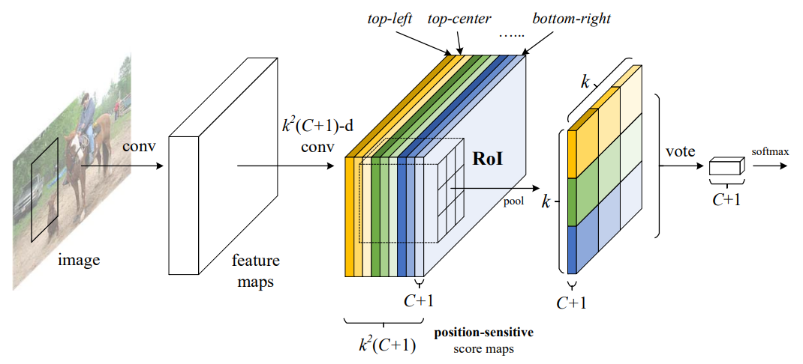
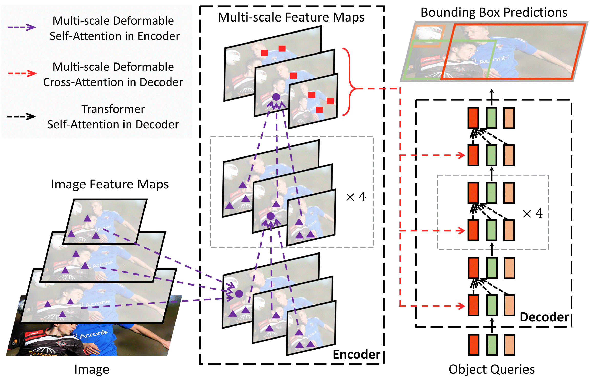
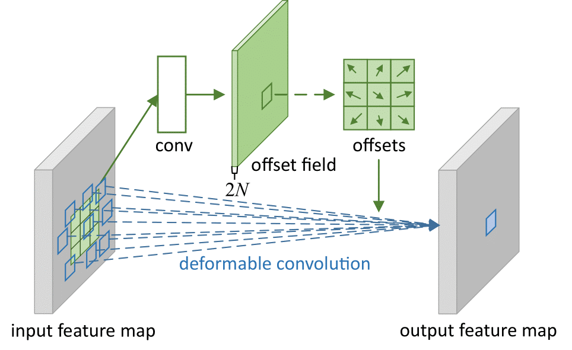
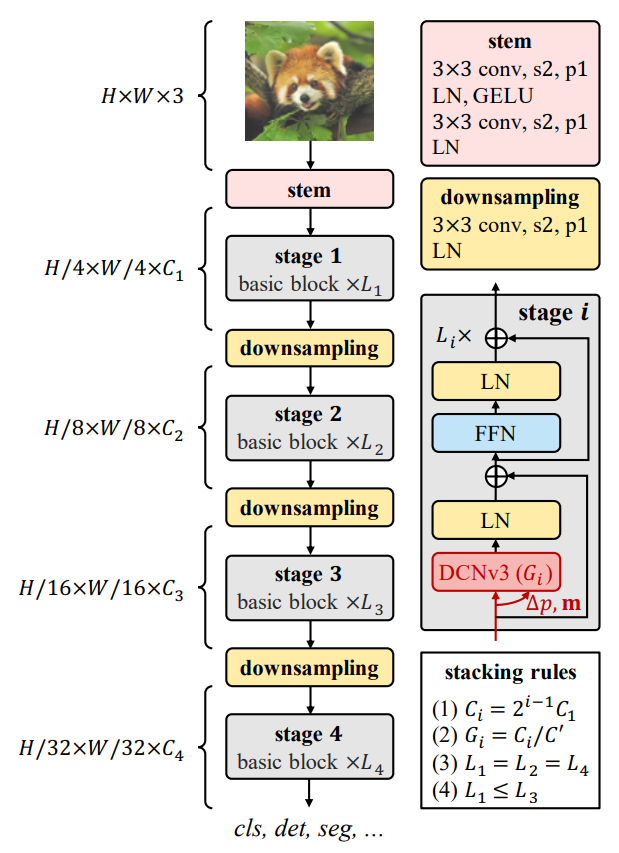

# Foundation Model for Visual Perception

Object detection and recognition are the basic problems of visual perception. We focus on designing vision backbones and object detection models to solve these problems and extending them to universal and large-scale foundation models for general perception tasks.

## Representative work:

### Object detection models with high precision and efficiency

- [**R-FCN: Object Detection via Region-based Fully Convolutional Networks**](https://arxiv.org/abs/1605.06409)

[Ranking 3rd of the most influential papers in NIPS 2016]
[Selected into the operator library of Pytorch]

 

  

 

- [**Deformable DETR: Deformable Transformers for End-to-End Object Detection**](https://arxiv.org/abs/2010.04159)

[Ranking 2nd of the most influential papers in ICLR 2021]

 

  

 

### Vision backbones with deformable convolutions & large-scale vision backbones
- **Deformable Convolutional Networks** [**v1**](https://arxiv.org/abs/1703.06211)/[**v2**](https://arxiv.org/abs/1811.11168)

[Ranking 6th of the most influential papers in ICCV 2017]
[Selected into the operator library of Pytorch]

 

  

 

- [**InternImage: Exploring Large-Scale Vision Foundation Models with Deformable Convolutions**](https://arxiv.org/abs/2211.05778) 

[CVPR 2023 highlight paper]

 

  

 