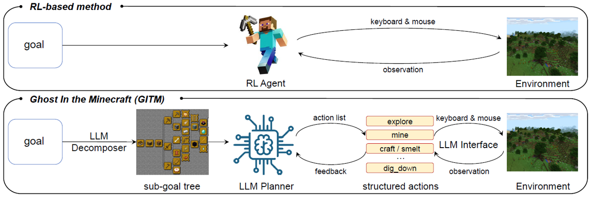

# Foundation Model for General Intelligent Agent

Towards the ultimate goal "General Artificial Intelligence (AGI)", we explore foundation models for general intelligent agents. We have designed agent framework integrating perception, planning, learning, and control based on large models, with which we constructed generally capable agents in open-world environments. We aim to realize embodied intelligence interacting with the real world.


## Representative Work:

### Generally Capable Agents in the Open-World Minecraft Game

- [**Ghost in the Minecraft: Generally Capable Agents for Open-World Environments via Large Language Models with Text-based Knowledge and Memory**](https://github.com/OpenGVLab/GITM)

  

 

  

&emsp;&emsp;**Demo Videos:**



