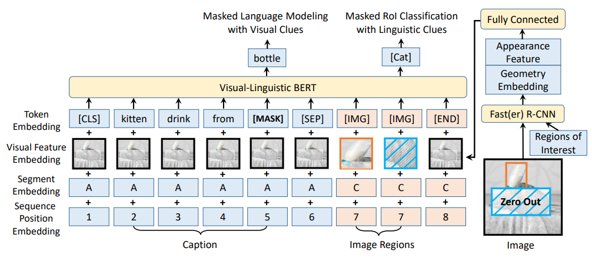
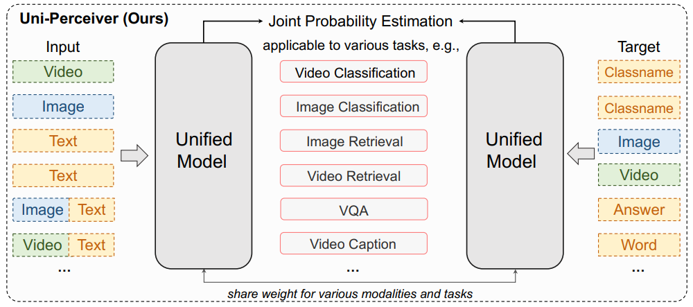
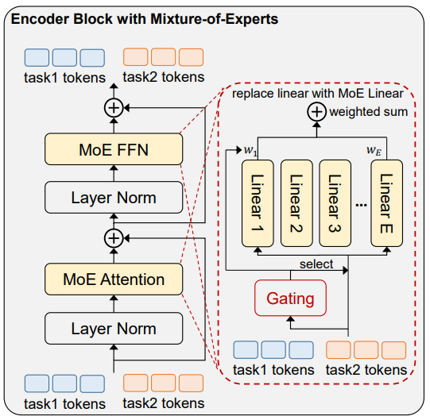
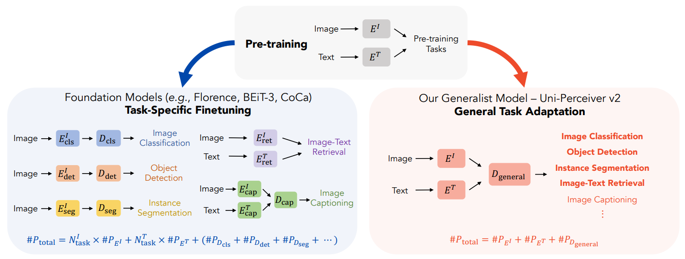
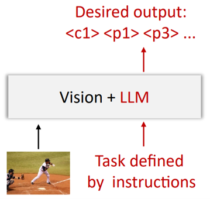
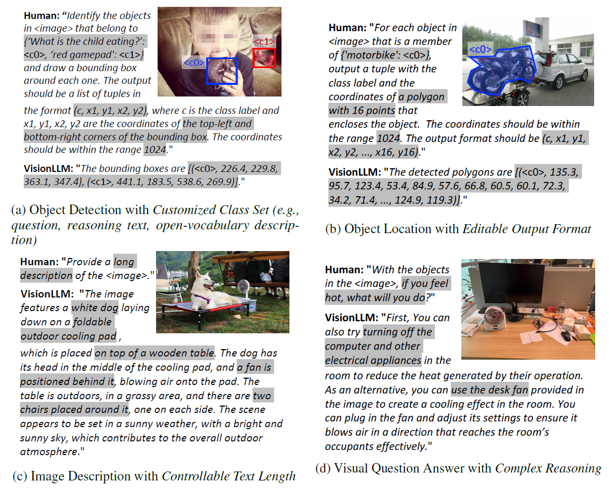

# Generic Model for Multi-modal Perception

We are dedicated to advancing the field of Multi-modal Generalist Model through innovative approaches. We aim to investigate unified task representations, network architecture, and training methods for visual and graph-text multi-modal tasks. We also seek to construct a generalist model for multi-modal tasks that encompasses various applications. In addition, we strive to design a novel universal perceptual paradigm based on large-scale models to achieve comprehensive capabilities geared toward open-world scenarios and open-ended tasks.



## Representative work:

### Unified Pre-training Algorithm for Large-scale Vision-Language Models

- [**VL-BERT: Pre-training of Generic Visual-Linguistic Representations**](https://arxiv.org/abs/1908.08530)

   [ICLR 2021 7th most influential paper]

  

### Unified Modeling and Architecture for General Multi-modal Perception Tasks 

- [**Uni-Perceiver: Pre-training Unified Architecture for Generic Perception for Zero-shot and Few-shot Tasks**](https://arxiv.org/abs/2112.01522)

  

- [**Uni-Perceiver-MoE: Learning Sparse Generalist Models with Conditional MoEs**](https://arxiv.org/abs/2206.04674)

   [NeurIPS 2022 Spotlight paper] 

  

- [**Uni-Perceiver v2: A Generalist Model for Large-Scale Vision and Vision-Language Tasks**](https://arxiv.org/abs/2211.09808)

   [CVPR 2023 Highlight paper] 

  

### Large Vision-Language Model for Open-Ended Vision-Centric Tasks

- [**VisionLLM: Large Language Model is also an Open-Ended Decoder for Vision-Centric Tasks**](https://arxiv.org/pdf/2305.11175.pdf)

  

 

  

